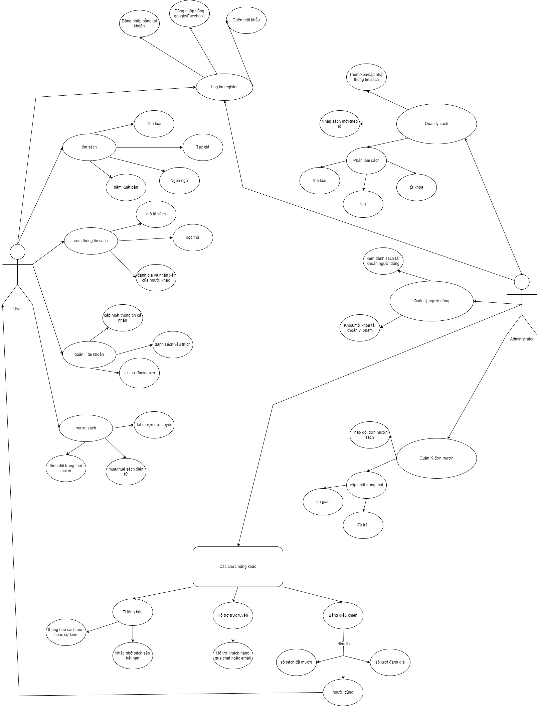
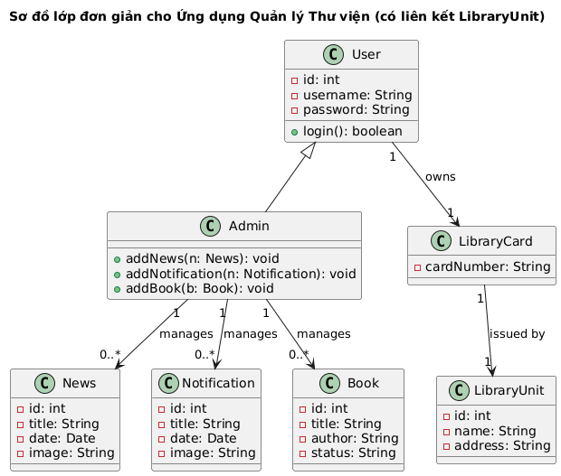
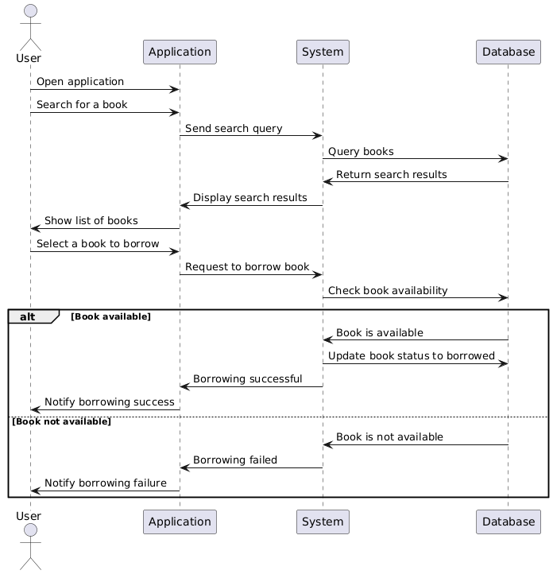
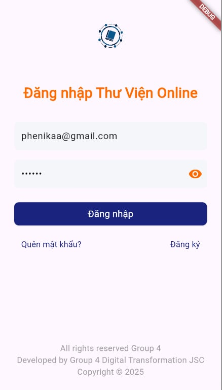
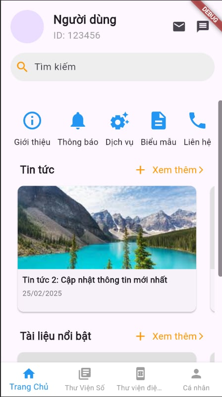
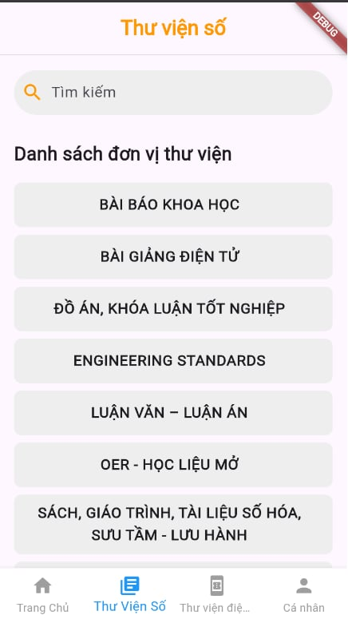
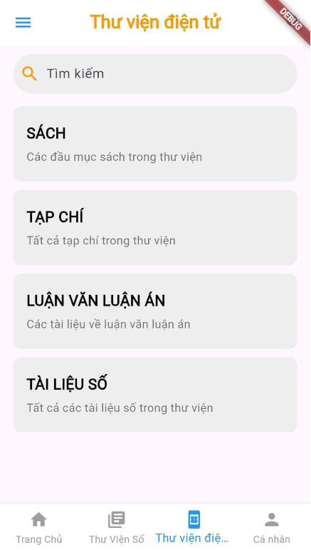
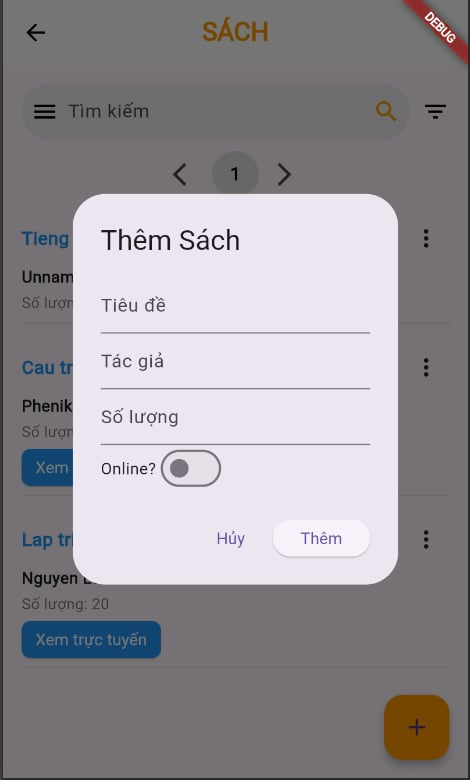
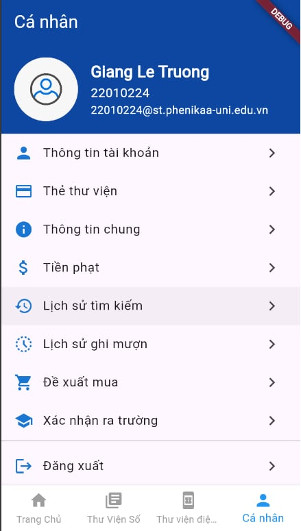

# Ứng dụng quản lý thư viện

## Thành viên
- Vũ Tuấn Anh
- Lê Trường Giang

## Sơ đồ chức năng

## structure diagram

## Sequence Diagram

## Giao diện app

## Tải mã nguồn Flutter từ GitHub (nhánh ổn định) về máy.
git clone https://github.com/flutter/flutter.git -b stable

## Thêm đường dẫn flutter/bin vào biến môi trường PATH để có thể chạy Flutter từ bất kỳ thư mục nào.
echo 'export PATH="$PATH:$(pwd)/flutter/bin"' >> ~/.bashrc

## Tải lại file cấu hình ~/.bashrc để áp dụng thay đổi biến môi trường PATH ngay lập tức.
source ~/.bashrc

## Kiểm tra phiên bản Flutter được cài đặt, đảm bảo nó hoạt động
flutter --version

## Kiểm tra cấu hình môi trường phát triển Flutter (các công cụ cần thiết như Android SDK, Chrome, v.v.).
flutter doctor

## Tạo một dự án Flutter mới với tên qltv_app.
flutter create qltv_app

## Di chuyển vào thư mục dự án qltv_app.
cd qltv_app

## Bật hỗ trợ phát triển ứng dụng Flutter Web.
flutter config --enable-web

# Hướng Dẫn Sử Dụng App Thư Viện Online

## 1. Giao Diện Đăng Nhập
- Người dùng cần nhập thông tin tài khoản để đăng nhập.
- Bên dưới có hai tùy chọn: **Đăng ký tài khoản** và **Quên mật khẩu**.
- Email đăng nhập phải có định dạng hợp lệ (@gmail.com), nếu không hệ thống sẽ báo lỗi.

## 2. Giao Diện Chính
Sau khi đăng nhập thành công, người dùng sẽ được chuyển đến giao diện chính của ứng dụng. Thanh điều hướng (**Navigator**) gồm 4 phần, tương ứng với 4 màn hình

### 2.1. Màn Hình Đầu Tiên
- Chứa các chức năng như **Giới thiệu**, **Thông báo**, **Dịch vụ**, v.v.
  

### 2.2. Màn Hình Thư Viện Số
- Hiển thị danh sách các thư viện số mà người dùng có thể truy cập và quản lý.

### 2.3. Màn Hình Thư Viện Điện Tử
- Cho phép người dùng thêm các loại sách vào thư viện cá nhân.
  
  

### 2.4. Màn Hình Cá Nhân
- Chứa các tính năng như **Thông tin tài khoản**, **Cài đặt**, **Góp ý**, v.v.
- Có tùy chọn **Đăng xuất**.
  

## 3. Đăng Xuất
- Khi chọn đăng xuất, hệ thống sẽ yêu cầu xác nhận.
- Nếu người dùng xác nhận đăng xuất, màn hình sẽ quay lại giao diện đăng nhập.

---

Cảm ơn bạn đã sử dụng ứng dụng Thư Viện Online!

## Hiển thị danh sách các thiết bị (thực hoặc giả lập) có thể chạy ứng dụng.
flutter devices

## Chạy ứng dụng Flutter trên một máy chủ web, cung cấp URL để truy cập qua trình duyệt.
flutter run -d web-server
