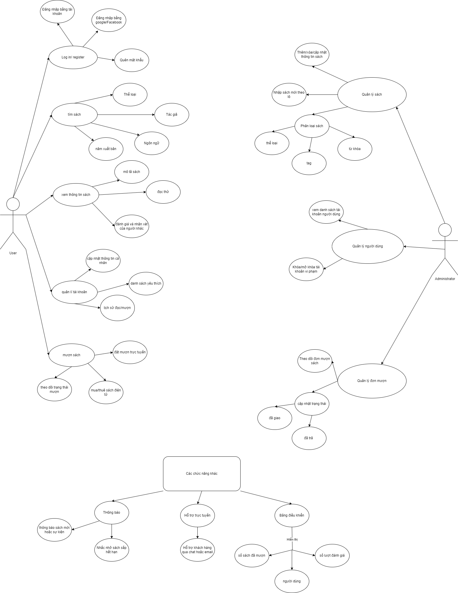

# Ứng dụng quản lý thư viện

## Thành viên
- Vũ Tuấn Anh
- Lê Trường Giang

## Sơ đồ chức năng

## class diagram

## Tải mã nguồn Flutter từ GitHub (nhánh ổn định) về máy.
git clone https://github.com/flutter/flutter.git -b stable

## Thêm đường dẫn flutter/bin vào biến môi trường PATH để có thể chạy Flutter từ bất kỳ thư mục nào.
echo 'export PATH="$PATH:$(pwd)/flutter/bin"' >> ~/.bashrc

## Tải lại file cấu hình ~/.bashrc để áp dụng thay đổi biến môi trường PATH ngay lập tức.
source ~/.bashrc

## Kiểm tra phiên bản Flutter được cài đặt, đảm bảo nó hoạt động
flutter --version

## Kiểm tra cấu hình môi trường phát triển Flutter (các công cụ cần thiết như Android SDK, Chrome, v.v.).
flutter doctor

## Tạo một dự án Flutter mới với tên qltv_app.
flutter create qltv_app

## Di chuyển vào thư mục dự án qltv_app.
cd qltv_app

## Bật hỗ trợ phát triển ứng dụng Flutter Web.
flutter config --enable-web

## Hiển thị danh sách các thiết bị (thực hoặc giả lập) có thể chạy ứng dụng.
flutter devices

## Chạy ứng dụng Flutter trên một máy chủ web, cung cấp URL để truy cập qua trình duyệt.
flutter run -d web-server
